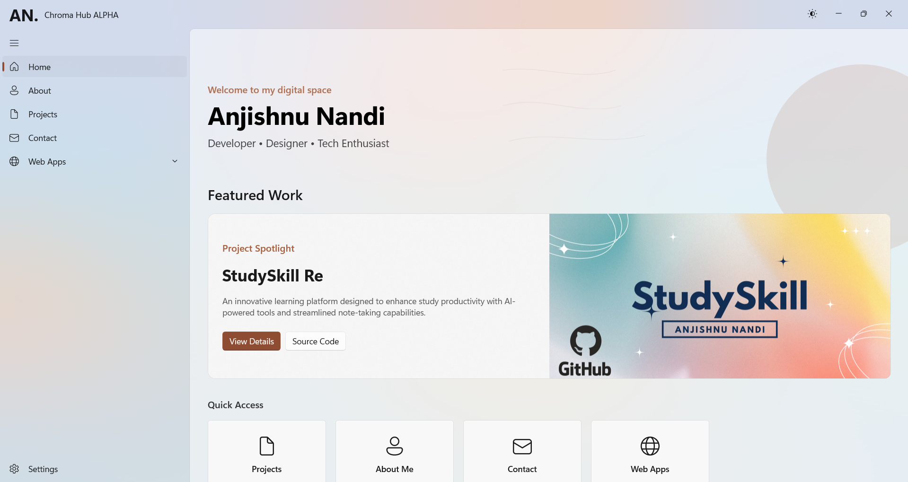
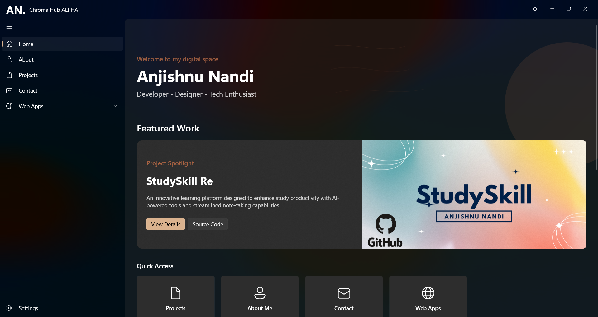
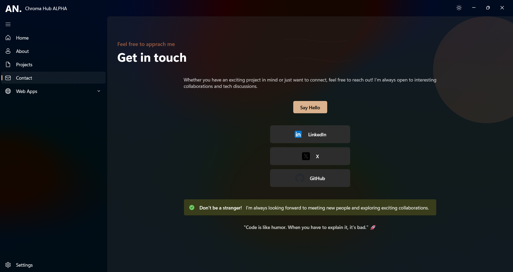

# ChromaHub

  
  <h3>A Modern Portfolio Experience Built with WinUI 3</h3>

## 🚀 Overview

ChromaHub is a sleek, modern Windows desktop application built using WinUI 3 that serves as my personal portfolio. The app showcases my projects, skills, and contact information in an interactive and visually appealing interface.

## ✨ Features

- **Responsive UI** - Fluid design that adapts to different window sizes
- **Theme Support** - Light/Dark mode and system theme integration
- **Mica Backdrop** - Beautiful translucent window effects using the latest Windows 11 visual styles
- **Smooth Animations** - Entrance transitions and parallax scrolling effects
- **Modern Navigation** - Intuitive navigation between different sections

## 📱 Screenshots

## 🛠️ Tech Stack

- **WinUI 3** - Modern Windows UI Library
- **C# / XAML** - Application logic and UI markup
- **Windows App SDK** - Modern Windows application development

## 📋 Pages

### Home
A welcoming landing page featuring:
- Personal introduction with animated text
- Featured project showcase
- Quick social media links
- Parallax background effects

### About
Details about my background and skills:
- Personal bio and profile picture
- Skills displayed in a clean, categorized layout
- Programming languages and frameworks visualization

### Projects
*(Not included in the provided files, but referenced in the code)*

### Contact
A simple way to connect:
- Direct email button
- Social media links
- Professional network connections

### Settings
App customization options:
- Theme selection (Light/Dark/System)
- Window backdrop style (Mica/Solid)
- Animation toggles
- About information and app version

## 🚀 Getting Started

### Prerequisites
- Windows 11 version 23H2 or higher

### Installation

1. Get the latest release https://github.com/cromaguy/ChromaHub/releases

2. Download zip and extract it

3. Follow mentioned steps

## 🔧 Configuration

The app stores user preferences for theme, backdrop style, and animation settings in the application's local settings storage. These settings persist between app launches.

## 🤝 Connect With Me

- **LinkedIn**: [anjishnu-nandi](https://linkedin.com/in/anjishnu-nandi)
- **X**: [@AnjiCroma](https://x.com/AnjiCroma)
- **GitHub**: [cromaguy](https://github.com/cromaguy)
- **Instagram**: [its.chroma.anji](https://instagram.com/its.chroma.anji)
- **Email**: [anjicroma@gmail.com](mailto:anjicroma@gmail.com)

## 📝 License

Copyright © 2025 Anjishnu Nandi. All rights reserved.

## 🙏 Acknowledgments

- [Microsoft WinUI Team](https://github.com/microsoft/microsoft-ui-xaml)
- [Windows App SDK](https://github.com/microsoft/WindowsAppSDK)