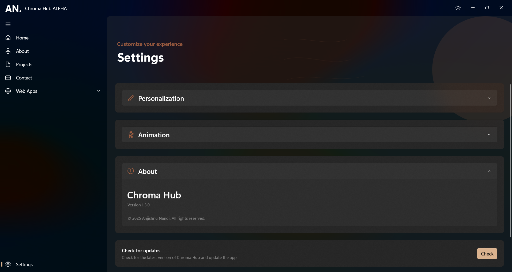

# ChromaHub 🎨

  
  <h2>Where Design Meets Technology</h2>
  
<i>A modern personal portfolio built with WinUI 3</i>

  
  

    <a href="#features">Features</a> •
    <a href="#screenshots">Screenshots</a> •
    <a href="#installation">Installation</a> •
    <a href="#pages">Pages</a> •
    <a href="#connect-with-me">Connect</a>
  

## ✨ About ChromaHub

ChromaHub is not just a portfolio - it's an immersive Windows desktop experience that showcases my work, skills, and creative journey through a sleek and responsive interface. Built with the latest Windows UI technologies, it represents the perfect blend of form and function.

> *"Transform ideas into reality through elegant code"*

 

## 🚀 Features

<table>
  <tr>
    <td><b>🎭 Theme Support</b></td>
    <td>Light & Dark modes with system theme synchronization</td>
  </tr>
  <tr>
    <td><b>✨ Mica Effects</b></td>
    <td>Beautiful translucent window effects with Windows 11 design language</td>
  </tr>
  <tr>
    <td><b>⚡ Smooth Animations</b></td>
    <td>Fluid entrance transitions and parallax scrolling</td>
  </tr>
  <tr>
    <td><b>📱 Responsive Design</b></td>
    <td>Adapts perfectly to any window size</td>
  </tr>
  <tr>
    <td><b>🧭 Intuitive Navigation</b></td>
    <td>Seamless experience between different sections</td>
  </tr>
</table>

 

## 📸 Screenshots

  
  
    
  
  
    
  
  
    
  

 

## 🛠️ Technology Stack

  <table>
    <tr>
      <td align="center"><b>WinUI 3</b></td>
      <td align="center"><b>C# / XAML</b></td>
      <td align="center"><b>Windows App SDK</b></td>
    </tr>
    <tr>
      <td align="center">Modern UI Framework</td>
      <td align="center">Application Logic & UI</td>
      <td align="center">Windows Development</td>
    </tr>
  </table>

 

## 📋 Pages

### 🏠 Home
- Animated personal introduction
- Featured project showcase with interactive elements  
- Social media quick-access buttons
- Dynamic parallax background effects

### 👤 About
- Personal bio with profile visualization
- Skills displayed in an elegant, categorized layout
- Programming languages and frameworks with custom icons

### 💼 Projects
- Showcase of personal and professional projects
- Interactive portfolio with rich media support
- Detailed project descriptions and technologies used

### 📞 Contact
- One-click email connection
- Professional social media links
- Clean, minimalist design for easy navigation

### ⚙️ Settings
- Theme customization (Light/Dark/System)
- Window backdrop style selection
- Animation preferences
- Application information

 

## 📥 Installation

### Requirements
- Windows 11 version 23H2 or higher

### Quick Setup
1. Download the latest release from [GitHub Releases](https://github.com/cromaguy/ChromaHub/releases)
2. Extract the ZIP archive to your preferred location
3. Run the provided installer and follow the on-screen instructions

 

## 🔧 Configuration

ChromaHub intelligently stores your preferences for:
- Theme selection
- Backdrop visual style
- Animation settings

All preferences are automatically persisted between application sessions using Windows local storage.

 

## 👋 Connect With Me

  
  
  
   
  
  

 

## 📝 License

  
Copyright © 2025 Anjishnu Nandi. All rights reserved.

 

## 🙏 Acknowledgments

- [Microsoft WinUI Team](https://github.com/microsoft/microsoft-ui-xaml) for the amazing UI framework
- [Windows App SDK](https://github.com/microsoft/WindowsAppSDK) for modern Windows development tools

  
Made with ❤️ by Anjishnu Nandi

